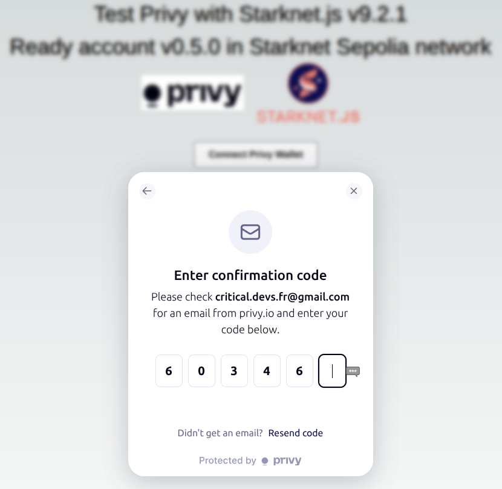
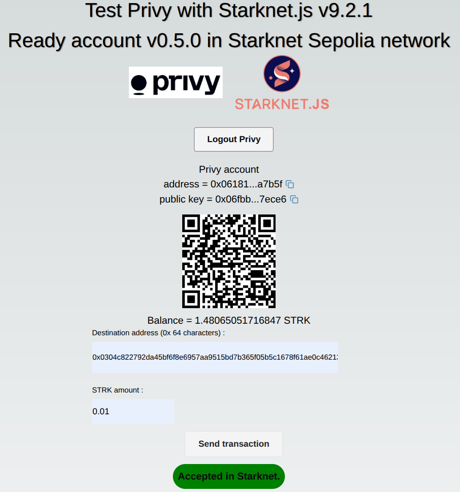

# 
<h1 style="text-align: center;"> Starknet-privy </h1>
 
<p align="center">
  
</p>

## Presentation

This small demo DAPP demonstrates how to develop a Starknet account without any needs of a passphrase or a specific password.  
It's using the privy libraries, in conjunction with a Starknet account that uses a Starknet standard signature.
By this way, you can create an account and validate your transactions with

- your email
- or your social password  

and nothing more needed.

> [!IMPORTANT]
> - Github stars are appreciated!
> - The DAPP is deployed [here](https://starknet-privy.vercel.app/)


Analyze the code to see how to create a such DAPP (start [here](https://github.com/PhilippeR26/starknet-privy/blob/main/src/app/page.tsx))  

The DAPP is made in the Next.js framework. Coded in Typescript. Using React, Zustand context & Chaka-ui components. The account contract used is the Ready v0.5.0 contract.

## Getting Started 🚀

- Create a privy account in https://www.privy.io/ , then creates a new application. Search the App ID.
- define a `.env.local` file including :
```bash
NEXT_PUBLIC_PROVIDER_URL = ""
# *** Sepolia testnet
SPONSOR_ACCOUNT_ADDRESS = "0x"
SPONSOR_ACCOUNT_PRIVATE = "0x"
# privy APP
NEXT_PUBLIC_PRIVY_APP_ID = ""
```
> where `NEXT_PUBLIC_PROVIDER_URL` is the key of your Alchemy Starknet Sepolia node (adapt the code if you have an another node), `SPONSOR_ACCOUNT_ADDRESS` & `SPONSOR_ACCOUNT_PRIVATE` are the data of an existing account in Sepolia network, funded with at least 2 STRK (it will be used as a sponsor for user accounts creation).
> 
- Run the development server: 
```bash
npm i
npm run dev
```

- Open [http://localhost:3000](http://localhost:3000) with your browser (Linux/Windows Chrome) to see the result.

> [!NOTE]
> Works with these hardwares: Windows, Linux, Android, Iphone

## Usage

Click on `Connect Privy Wallet`, enter your email, then get the code in your mail box, and write it in the APP.


If it's your first connection, click on the `Create account` button, and wait few seconds.
Then you have a fresh new Starknet account, funded with 1.5 STRK.

### Immediate transaction
You have just to define the recipient and the STRK amount, then click on `Send transaction`.  
After 5 to 10s, the transaction success is reported.


### Delayed transaction
TBD

## Deploy on Vercel 🎊

The easiest way to deploy your Next.js app is to use the [Vercel Platform](https://vercel.com/new?utm_medium=default-template&filter=next.js&utm_source=create-next-app&utm_campaign=create-next-app-readme) from the creators of Next.js.

Check out the [Next.js deployment documentation](https://nextjs.org/docs/deployment) for more details.

> You can test this DAPP ; it's already deployed at [https://cairo1-js.vercel.app/](https://cairo1-js.vercel.app/).

If you fork this repo, you need a Vercel account. You can configure your own environment variables for the Server side :  

