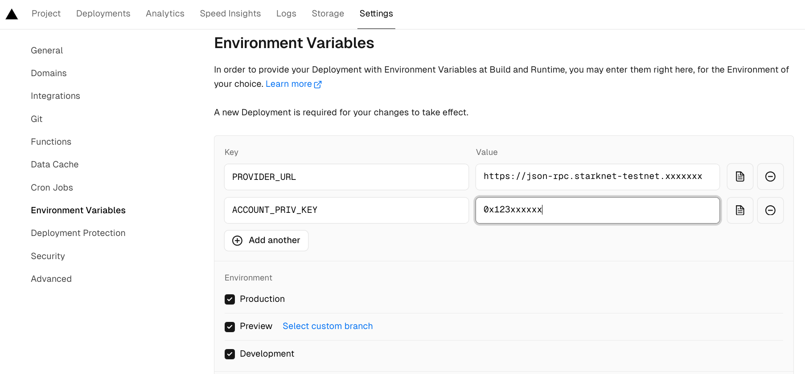

# Starknet-privy


## Presentation

This small demo DAPP demonstrates how to develop a Starknet account without any needs of a passphrase or a specific password.  
It's using the privy libraries, in conjunction with a Starknet account that uses a Starknet standard signature.
By this way, you can create an account and validate your transactions with
- your fingerprint
- or your faceId 
- or your email
- or your social password  
and nothing more needed.

> [!IMPORTANT]
> - Github stars are appreciated!
> - The DAPP is deployed [here]()


Analyze the code to see how to create a such DAPP (start [here](https://github.com/PhilippeR26/starknet-privy/blob/main/src/app/page.tsx))  

The DAPP is made in the Next.js framework. Coded in Typescript. Using React, Zustand context & Chaka-ui components. The account contract used is the Ready v0.5.0 contract.

## Getting Started 🚀

- Define your own privy account
- define a .env.local file
- Run the development server: 
```bash
npm i
npm run dev
```

- Open [http://localhost:3000](http://localhost:3000) with your browser (Linux/Windows Chrome) to see the result.

> [!NOTE]
> Works with these hardwares: Windows, Linux, Android, Iphone

## Usage


## Deploy on Vercel 🎊

The easiest way to deploy your Next.js app is to use the [Vercel Platform](https://vercel.com/new?utm_medium=default-template&filter=next.js&utm_source=create-next-app&utm_campaign=create-next-app-readme) from the creators of Next.js.

Check out the [Next.js deployment documentation](https://nextjs.org/docs/deployment) for more details.

> You can test this DAPP ; it's already deployed at [https://cairo1-js.vercel.app/](https://cairo1-js.vercel.app/).

If you fork this repo, you need a Vercel account. You can configure your own environment variables for the Server side :  

